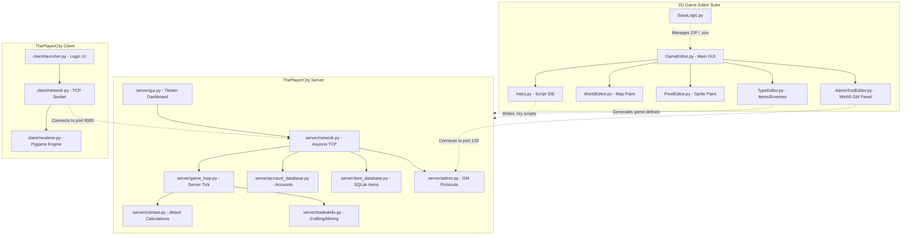

# 🕹️✨ 2D Game Editor & ThePlayerCity Engine v2.1 ✨🕹️

Welcome to the ultimate repository containing the **2D Game Editor** (content creation suite) and the **ThePlayerCity** (multiplayer retro RPG engine). This project marks the successful C++-to-Python migration of the legacy *Memoria* MMO engine into a modular, clean, and modern codebase.

---

## 🗺️ Architectural Ecosystem Overview

The workspace is divided into two primary sub-systems:
1. **2D Game Editor**: A comprehensive desktop toolset designed for creating assets, maps, scripts, items, and NPCs. It maintains a Win95 aesthetic while utilizing background threading, atomic save systems, and live reload watchers.
2. **ThePlayerCity Engine**: A production-ready Python multiplayer client-server implementation. It implements a custom encrypted TCP protocol, SQLite database architecture, tick-based server loops, combat systems, and a fully featured Pygame-based client interface.



---

## 🎨 1. 2D Game Editor Features

### 🖌️ Pixel Editor & Tileset Management
* **Dual-Editor Design**: Double-click any tile on your tileset sheet to open a dedicated 16x16 pixel editor.
* **Full Toolset**: Features a Pencil, Eraser, Eyedropper, Paint Bucket, and full Undo/Redo historical queues.
* **Collision Painter**: Paint physical properties directly onto tiles (solid, passable, water, etc.) which write structural metadata readable by the engine.

### 🏷️ Unified Databases & Type Editors
* **Weapon & Armor Editors** ([WeaponData.py](file:///e:/2DGameEditor/WeaponData.py), [ArmorData.py](file:///e:/2DGameEditor/ArmorData.py)): Full stat modifiers, level requirements, durability, and graphic assignments.
* **Useable & Collectable Items** ([UseableItemEditor.py](file:///e:/2DGameEditor/UseableItemEditor.py), [CollectableEditor.py](file:///e:/2DGameEditor/CollectableEditor.py)): Design potions, quest tokens, mining picks, and crafting items.
* **Monster & NPC Definition Editors** ([MonsterTypeEditor.py](file:///e:/2DGameEditor/MonsterTypeEditor.py), [NPCData.py](file:///e:/2DGameEditor/NPCData.py)): Configure HP, MP, base stats, attack speed, movement timers, and dynamic loot drop tables.

### 🧱 Prefabs & World Painting
* **Chunk Editor** ([ChunkEditor.py](file:///e:/2DGameEditor/ChunkEditor.py)): Combine standard tiles into reusable 16x16 structures (such as houses, ruins, or specific foliage clusters).
* **World Editor** ([WorldEditor.py](file:///e:/2DGameEditor/WorldEditor.py)): A layered map editor supporting background tile placement, spawn zones, safe zones, and warp points (POI).
* **Visual Helpers**: Features copy/paste block matrices, grid alignments, category filters, and live-rendered animation frames.

### 📜 Hairy Script Editor (IDE)
* **Double-Bridge Syncing**: Creating items, creatures, or variables automatically inserts `#Define` declarations into the script files. Editing script files automatically updates placeable types inside the World Editor.
* **Syntax Highlighting**: Supports color-coding for event hooks (`OnUse`, `OnTalk`, `OnTick`), operators, variables, and commands.

### 🛡️ Safety & Threading
* **Background Threading**: Image caching and database indexing are processed in background worker threads so the user interface never freezes.
* **Atomic Save System**: Writes to temporary sidecars first, swapping them atomically upon completion to guarantee your `.sav` projects are never corrupted.

---

## 🚀 2. ThePlayerCity Multiplayer Engine

### ⚙️ Game Server Architecture
* **Asyncio Network Hub** ([server/network.py](file:///e:/2DGameEditor/ThePlayerCity/server/network.py)): An asynchronous, TCP socket server handling multiple simultaneous connections.
* **Salted Encryption Protocol** ([core/crypto.py](file:///e:/2DGameEditor/ThePlayerCity/core/crypto.py)): Uses a custom XOR encryption protocol. The master key (`TCPKEY`) is declared in [server/constants.md](file:///e:/2DGameEditor/ThePlayerCity/server/constants.md) and can be rotated server-side dynamically without code modifications.
* **State Persistence**: 
  - `accounts.db`: SQLite database managing player registration, login authentication, credentials, and ban flags.
  - `items.db` ([server/item_database.py](file:///e:/2DGameEditor/ThePlayerCity/server/item_database.py)): Dedicated SQLite database storing item instances, durability, owners, and locations (worn, bank, ground, backpack).
* **Server Tick Loop** ([server/game_loop.py](file:///e:/2DGameEditor/ThePlayerCity/server/game_loop.py)): Processes combat queues, natural health/mana regeneration, monster AI paths, spawner timers, and server-wide autosaves.
* **Subsystems**:
  - **Combat** ([server/combat.py](file:///e:/2DGameEditor/ThePlayerCity/server/combat.py)): Calculates damage formulas, level adjustments, death penalties, and corpse generation.
  - **Tradeskills** ([server/tradeskills.py](file:///e:/2DGameEditor/ThePlayerCity/server/tradeskills.py)): Handles resource nodes, mining actions, smelting raw ore, and blacksmithing equipment.
  - **Socials** ([server/chat.py](file:///e:/2DGameEditor/ThePlayerCity/server/chat.py) / [server/guilds.py](file:///e:/2DGameEditor/ThePlayerCity/server/guilds.py) / [server/trade.py](file:///e:/2DGameEditor/ThePlayerCity/server/trade.py)): Whisper, global, and guild chat routing, guild creation, and locked double-agree P2P secure trading.

### 🎮 Pygame Game Client
* **Game Launcher** ([client/launcher.py](file:///e:/2DGameEditor/ThePlayerCity/client/launcher.py)): Features an authentic login, register, and character-creation/race-selection interface.
* **World Renderer** ([client/renderer.py](file:///e:/2DGameEditor/ThePlayerCity/client/renderer.py)): A hardware-accelerated Pygame screen displaying tiles, dynamic player/NPC movement updates, animated terrain (water, campfires), and other players online.
* **HUD Overlay**:
  - **Backpack & Equipment Panels**: Interactive grid slots displaying item tooltips and full mouse drag-and-drop support.
  - **Chat Console & Log**: Tracks combat messages, global shouts, local whispers, and guild chat.
  - **Minimap**: Automatically updates a scaled radar view of the local area.

---

## 🛠️ 3. Administrative & GM Tools

* **Server Dashboard GUI** ([server/gui.py](file:///e:/2DGameEditor/ThePlayerCity/server/gui.py)): A Tkinter dashboard monitoring system logs, listing accounts, and allowing manual account creation, bans, or saves.
* **Win95 GM Tool** ([AdminToolEditor.py](file:///e:/2DGameEditor/AdminToolEditor.py)): Integrated directly into the main Game Editor. Allows GMs to connect remotely via a secure TCP channel (packet ID 125) to:
  - List online players, browse accounts, and inspect character profiles.
  - Modify character stats (Strength, Constitution, level, coordinates, HP/MP max).
  - Search items across all player inventories, bank slots, and ground containers.
  - Send global system announcements or trigger emergency server-wide saves.
* **CLI Admin Tool** ([editor/admin_tool.py](file:///e:/2DGameEditor/ThePlayerCity/editor/admin_tool.py)): Command-line implementation of the remote GM management utility.

---

## 📂 File Directory Map

```
2DGameEditor/
│
├── 📂 ThePlayerCity/                   # The MMO Game Files
│   ├── 📄 main.py                      # Starts Server + Tkinter Dashboard
│   ├── 📄 run_server.bat               # Starts Server directly
│   ├── 📄 run_client.bat               # Starts Launcher directly
│   │
│   ├── 📂 core/                        # Shared Client-Server Logic
│   │   ├── config.py                   # HryParser reads HAIRY config scripts
│   │   ├── creatures.py                # NPC/Monster templates
│   │   ├── crypto.py                   # XOR packet cryptographer
│   │   ├── items.py                    # Weapon/Armor enums and bases
│   │   ├── maps.py                     # Map chunking, passability, SQLite bindings
│   │   ├── models.py                   # Character, Account, Guild, Skill models
│   │   └── packets.py                  # Network packet formats
│   │
│   ├── 📂 server/                      # Server-Only Modules
│   │   ├── network.py                  # TCP asyncio listener
│   │   ├── game_loop.py                # Main clock, AI, regen
│   │   ├── combat.py                   # Damage, death penalties, PVP rules
│   │   ├── items.py                    # Ground drops, splitting, inventory moves
│   │   ├── tradeskills.py              # Mining, smelting, forging mechanics
│   │   ├── guilds.py                   # Guild registers, ranks, rosters
│   │   ├── trade.py                    # Locked trading slots
│   │   ├── chat.py                     # Chat channels (say, whisper, shout, guild)
│   │   ├── admin.py                    # GM authorization & packet handler
│   │   ├── gui.py                      # Tkinter server console
│   │   ├── database.py                 # Core database coordinator
│   │   ├── account_database.py         # Account persistence
│   │   └── item_database.py            # SQLite item CRUD
│   │
│   ├── 📂 client/                      # Pygame Client Code
│   │   ├── launcher.py                 # Launcher, login UI
│   │   ├── network.py                  # Client socket receiver
│   │   └── renderer.py                 # Pygame render loop & HUD panels
│   └── 📂 editor/                      # Command-line admin interface
│
├── 📂 Assets/                          # Sprite sheets, items, audio assets
├── 📂 HAIRY/                           # .hry script configurations
├── 📂 Saves/                           # Editor project workspaces (.sav)
├── 📄 GameEditor.py                    # Main Desktop Editor launcher
├── 📄 run.bat                          # Starts Editor Suite on Windows
│
├── 📂 [Editors]                        # Component editors called by GameEditor
│   ├── PixelEditor.py                  # Sprite drawing editor
│   ├── TilesetEditor.py                # Asset properties painter
│   ├── WorldEditor.py                  # Map constructor
│   ├── ChunkEditor.py                  # Prefabs creator
│   ├── TypeEditor.py                   # Database properties Editor
│   ├── WeaponData.py / ArmorData.py    # Item databases
│   ├── UseableItemEditor.py            # Potion/Tool editor
│   ├── CollectableEditor.py            # Materials editor
│   ├── MonsterTypeEditor.py            # Monster stats editor
│   ├── MonsterSpawnEditor.py           # Spawns paint tool
│   ├── NPCSpawnEditor.py               # NPC spawner paint tool
│   ├── SafeZoneEditor.py               # Safe zone painter
│   ├── ObjectSheetEditor.py            # Interactable object configs
│   ├── ShopEditor.py                   # Shopkeeper vendor stock
│   ├── SkillEditor.py                  # Skill stats config
│   └── AdminToolEditor.py              # GM admin panel
│
└── 📂 [Core Editor Libs]
    ├── SaveLogic.py                    # ZIP / pool atomic saves manager
    ├── Hairy.py                        # Script parser UI
    ├── ScriptParser.py                 # AST compile parser
    ├── DatabaseManager.py              # Metadata database controller
    └── WorldDatabaseManager.py         # World loader controller
```

---

## 🚀 How to Run

### Prerequisite Dependencies
Ensure you have **Python 3.10+** installed. Install the necessary packages via terminal/cmd:
```bash
pip install Pillow pystray pygame
```

### 1. Launching the 2D Game Editor
* **Windows**: Double-click **`run.bat`** in the root folder.
* **Mac / Linux**: Open terminal in the root folder and run:
  ```bash
  python GameEditor.py
  ```

### 2. Running the Multiplayer Game

#### Step A: Run the Server
1. Navigate into the `ThePlayerCity` folder.
2. Double-click **`run_server.bat`** (Windows) or execute:
   ```bash
   python main.py
   ```
3. The server Tkinter console will open. Verify that the database loaded.

#### Step B: Run the Client
1. Navigate into the `ThePlayerCity` folder.
2. Double-click **`run_client.bat`** (Windows) or execute:
   ```bash
   python -m client.launcher
   ```
3. Enter account details or register a new character to log in and play!

---

Enjoy editing and building your custom retro RPG worlds! 🎮✨
